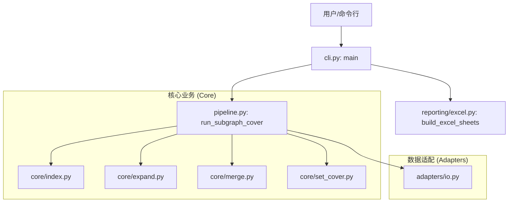

# Defect Subgraph Cover Module

## 简介 (Introduction)

本模块实现了基于缺陷报告的子图覆盖算法。它通过分析缺陷报告中的实体，在知识图谱中扩展出相关的子图，并使用贪心集合覆盖算法（Greedy Set Cover）筛选出能够覆盖最多缺陷报告的最优子图集合。

该模块经过重构，采用了分层架构，实现了核心逻辑与数据适配、报表生成的解耦。

## 架构概览 (Architecture)

本模块的调用关系如下所示：



## 目录结构 (Directory Structure)

*   **`cli.py`**: 命令行入口，负责参数解析、流程串联和最终输出。
*   **`pipeline.py`**: 核心管道，封装了从索引构建到子图覆盖的完整业务流程。
*   **`core/`**: 包含纯粹的算法逻辑，不依赖具体文件格式。
    *   `index.py`: 构建图索引。
    *   `expand.py`: 从种子节点扩展子图。
    *   `merge.py`: 基于 Jaccard 相似度合并子图。
    *   `set_cover.py`: 贪心集合覆盖算法。
*   **`adapters/`**: 数据适配层，负责处理文件 I/O。
    *   `io.py`: 读取 Excel 数据并转换为内部数据结构。
*   **`reporting/`**: 报表生成层。
    *   `excel.py`: 将计算结果格式化为 Excel 报表。

## 使用方法 (Usage)

### 1. 命令行运行 (CLI)

在项目根目录下运行：

```bash
python -m src.defect_subgraph_cover.cli \
    --nodes_path "path/to/nodes.xlsx" \
    --edges_path "path/to/edges.xlsx" \
    --defects_path "path/to/defects.xlsx" \
    --output_dir "output_directory"
```

### 2. 代码调用 (Programmatic)

```python
from src.defect_subgraph_cover.pipeline import run_subgraph_cover
from src.defect_subgraph_cover.adapters.io import load_nodes_xlsx, load_edges_xlsx, load_defects_optional

# 1. 加载数据
nodes_df = load_nodes_xlsx(nodes_path)
edges_df = load_edges_xlsx(edges_path)
defect_reports = load_defects_optional(defects_path)

# 2. 运行管道
result = run_subgraph_cover(
    nodes_df=nodes_df,
    edges_df=edges_df,
    defect_reports=defect_reports,
    alpha=0.5,  # 相似度阈值
    k_hops=2    # 扩展跳数
)

# 3. 获取结果
print(f"Total subgraphs: {len(result.final_subgraphs)}")
print(f"Covered reports: {len(result.cover_result.covered_elements)}")
```
