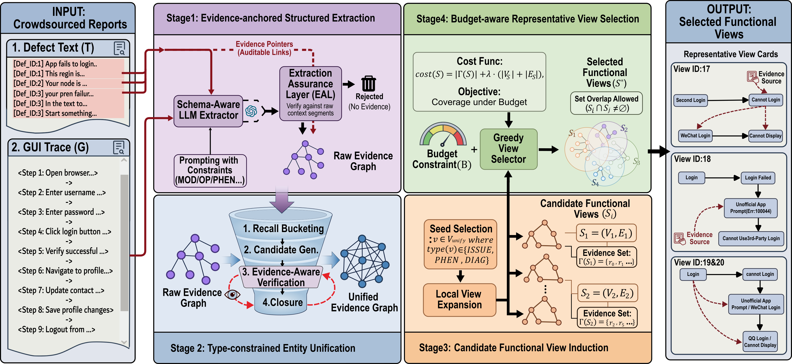

# From Clusters to Views: Entity-Centric Functional Aggregation of Crowdsourced Test Reports

<p align="center">
  <a href="https://conf.researchr.org/home/ase-2026"></a>
  <a href="https://anonymous.4open.science/r/ASE-ECFA-F3DB"></a>
  
  
</p>

> **ASE 2026** · IEEE/ACM International Conference on Automated Software Engineering · Munich, Germany · October 12–16, 2026

---

## Abstract

Crowdsourced testing improves defect discovery but creates a triage bottleneck: developers must inspect volumes of noisy and heterogeneous reports whose failure evidence is fragmented across reports and crosses clustering boundaries. Existing defect aggregation pipelines typically organize reports into disjoint clusters, which poorly matches this overlap-prone evidence structure.

We propose **ECFA (Entity-Centric Functional Aggregation)**, a framework that converts reports into an evidence graph and outputs a budget-aware set of traceable *functional views* rather than a disjoint partition. ECFA combines evidence-anchored extraction, type-constrained entity unification, localized view induction, and budget-aware view selection. The resulting views preserve links to supporting evidence and enable cross-cluster retrieval through shared structural entities.

---

## Overview

<p align="center">
  
</p>


<p align="center">
  <em>Figure 1: ECFA progressively transforms free-form crowdsourced reports into a budget-aware set of traceable, overlap-aware functional views through four stages: <strong>Extract → Unify → Induce → Select</strong>.</em>
</p>

---

## Key Contributions

1. **Problem Reformulation.** We identify a fundamental mismatch between disjoint clustering and the overlap-prone evidence structure of crowdsourced test reports, and reformulate report aggregation as the construction of *traceable, overlap-aware functional views* rather than disjoint clusters.

2. **ECFA Framework.** We propose a four-stage pipeline that operationalizes this reformulation through schema-constrained LLM extraction, type-constrained entity unification, localized view induction, and budget-aware representative view selection.

3. **Empirical Evaluation.** We provide empirical evidence on ECFA's structural effects (RQ1), budget-constrained selection behavior (RQ2), and cross-cluster retrieval performance (RQ3), supported by a blinded audit subset and a pilot human-task study on real-world mobile crowdsourced testing data.

---

## Method: The Four Stages

| Stage | Name | Description |
|:-----:|------|-------------|
| **1** | **Extract** | A Schema-Aware LLM Extractor with an Extraction Assurance Layer (EAL) converts each free-text report into span-grounded entities and typed relations, forming a *Raw Evidence Graph* with full provenance links. |
| **2** | **Unify** | Type-constrained entity unification via *Four-stage Synonym Alignment* (FSA) reduces cross-report lexical fragmentation, consolidating equivalent mentions into canonical representatives while preserving provenance. |
| **3** | **Induce** | Localized *candidate functional views* are induced by expanding from clue-bearing seed nodes (`ISSUE`, `PHEN`, `DIAG`), each subgraph anchored to its supporting reports and source spans. |
| **4** | **Select** | A greedy budget-aware selector maximizes clue coverage under bounded review cost, optionally preceded by semantic merging of near-duplicate candidates, yielding the final view set **S\***. |

### Entity Schema

| Type | Abbr. | Role in ECFA |
|------|:-----:|-------------|
| FunctionalModule | `MOD` | Functional context (page, feature, flow) |
| UserAction | `OP` | Triggering interaction and target |
| ObservedSymptom | `PHEN` | User-observable abnormal outcome |
| SystemDiagnosis | `DIAG` | System-presented diagnostic signal |
| ImpactElement | `ELEM` | Affected UI element or object |
| ProblemStatement | `ISSUE` | Compact problem label for coverage accounting |

---

## Datasets

Evaluated on real-world crowdsourced defect reports from **6 mobile apps** sourced from an industrial crowdsourced testing platform.

| App | #Reports | #Entities | #Edges | #Clusters |
|-----|:--------:|:---------:|:------:|:---------:|
| Slife | 1,348 | 4,053 | 4,271 | 88 |
| Huawei Health | 218 | 872 | 764 | 15 |
| Hujiang English | 256 | 1,055 | 1,051 | 24 |
| Tuniu | 2,910 | 7,681 | 7,756 | 79 |
| IELTS Listening | 265 | 898 | 813 | 21 |
| JayMe | 681 | 2,237 | 2,442 | 60 |
| **Total** | **5,678** | **16,796** | **17,097** | **287** |

---

## Main Results

### RQ1 — Entity Unification Improves Graph Connectivity and Coverage

Entity unification consistently reduces fragmentation (↓42–145 connected components), enlarges the largest connected component (↑4.0–29.4 pp LCC ratio), strengthens cross-report edge coupling (CER ↑2.8–14.4 pp), and raises fixed top-K coverage (nAUC@50 ↑0.033–0.172) across **all six apps**. Manual audit confirms high merge precision (**1.000** at the pair level, **0.899** overall assignment precision).

### RQ2 — Budget-Aware Selection Improves Reviewability

Under a shared internally calibrated review-cost budget, ECFA (Full) achieves the highest report coverage across all six apps (0.655–0.877) while consistently selecting **50 views** within budget. Key ablation findings:
- **Removing cost normalization** → *perspective collapse*: only 6–22 views selected, budget consumed by a few large views.
- **Removing semantic merging** → candidate pool inflates 2–3× with minimal coverage benefit.

### RQ3 — Structure-Aware Retrieval Recovers Cross-Cluster Evidence

Even under the strongest LLM-based clustering boundary, **72.72%** of queries retain cross-cluster relevant reports. ECFA-Retr consistently outperforms all text-only baselines under every fixed boundary:

| Boundary | Method | Success@20 | MRR@20 | nDCG@20 | Recall@20 |
|----------|--------|:----------:|:------:|:-------:|:---------:|
| LLMCluster | Global (text) | 56.33% | 0.183 | 0.184 | 33.02% |
| LLMCluster | **ECFA-Retr** | **74.95%** | **0.306** | **0.296** | **48.52%** |
| SBERT+HC | Global (text) | 41.55% | 0.076 | 0.091 | 20.03% |
| SBERT+HC | **ECFA-Retr** | **68.52%** | **0.251** | **0.241** | **40.40%** |
| TF-IDF+HC | Global (text) | 51.32% | 0.101 | 0.120 | 24.92% |
| TF-IDF+HC | **ECFA-Retr** | **70.96%** | **0.254** | **0.229** | **38.07%** |

A **pilot human-task study** (12 student–app units, under LLMCluster) further shows ECFA reduces triage time (31.5 → 25.6 min) and improves Theme-F1 (0.613 → 0.707) and First-Inspect Hit@2 (0.50 → 0.75), winning **10 of 12** units.

---

## Repository Layout

```text
.
├── figures/
│   └── main.png              # Main architecture figure (Figure 1)
├── src/
│   ├── rq1/                  # Graph construction & connectivity metrics
│   ├── rq2/                  # Budget-aware selection, ablations, reporting
│   └── rq3/                  # Cross-cluster retrieval & human audit pipeline
├── data/
│   ├── shared_graph_inputs/  # Frozen extraction outputs (ROOT_glm4.7/)
│   ├── rq2/                  # RQ2 datasets and figure inputs
│   └── rq3/                  # RQ3 annotated datasets and audit files
├── results/
│   ├── rq1/                  # Graph metrics & coverage tables
│   ├── rq2/                  # Selection result exports
│   └── rq3/                  # Retrieval metrics, blinded audit, human study
└── docs/                     # Supporting notes and experiment documentation
```
